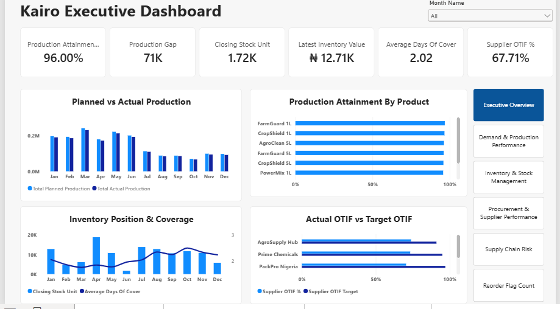
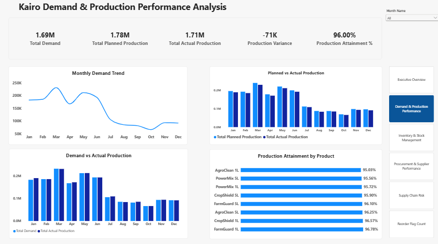
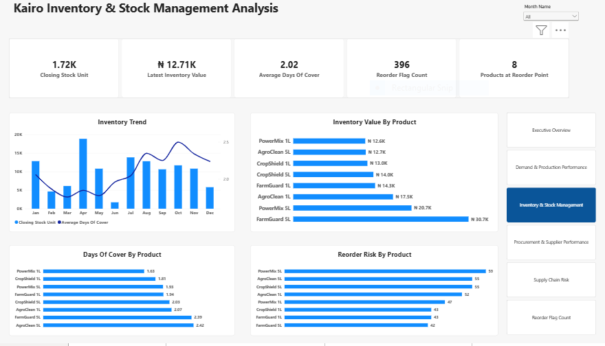
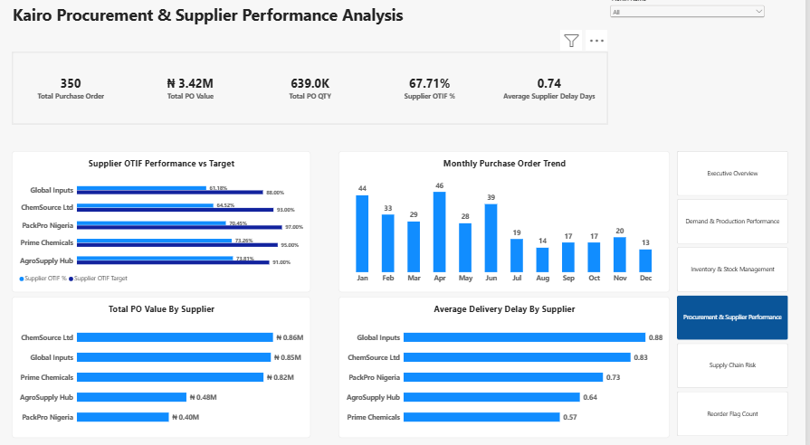
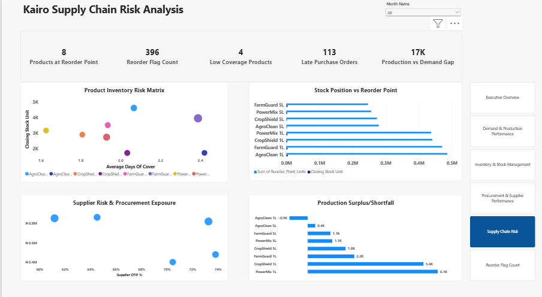

# Kairo Limited Supply Chain Operations Analytics
## An executive-level Supply & Operations Analytics solution for Kairo Limited, providing deep visibility into production, inventory, procurement, demand, and supplier performance. The analysis identifies critical operational gaps and risks, enabling the Board and senior leadership to take timely, data-driven actions to improve efficiency, continuity, and overall business performance. 
[Interactive_Power_BI_Link](https://app.powerbi.com/view?r=eyJrIjoiZWNkMGIxYTctMzA3Yy00MDU2LWJjYjMtZWM4ODkwMmU5NDZkIiwidCI6IjY0M2NkODIwLWU2YzYtNGI2ZC05ZDc5LTJjOTgwOTllMTg3MCJ9)

## The Business Problem
Management needs an integrated view of how the business is performing across its operational units and how these functions work together to meet customer demand. The key challenge is understanding the relationship between demand, production, inventory, procurement, and supplier performance—and identifying where weaknesses in one area create downstream operational risks. This project provides executive-level visibility into these interconnected processes, enabling leadership to identify performance gaps, supply-chain bottlenecks, and critical risks requiring timely intervention. 
## Key Questions Addressed:
- Is the plant producing according to plan ?
- Is the plant achieving good production attainment?
- Is production meeting its monthly demand ?
- Are suppliers delivering on time ?
- Where is procurement/inventory money tied up ?
- Which products are approaching reorder level ?
  
## Management Findings & Recommendations 
### Production is performing strongly, but not fully meeting plan
### Finding:
- Total planned production: 1.78M units
- Actual production: 1.71M units
- Production attainment: 96%
- Production variance: approximately -71K units
This means the operation delivered a strong 96% of plan, but still left approximately 71K units of planned production unfulfilled. 
### Operational risk
If the production shortfall persists, it could eventually affect inventory availability and the company's ability to respond to demand.
### Possible root causes 
- Production downtime
- Material availability constraints
- Production capacity limitations
- Changeover/setup losses
- Maintenance-related interruptions
- Production planning not fully aligned with available capacity
### Recommendation
Management should investigate the 71K production gap by month and product, identifying the specific products and periods responsible for the shortfall. Production planning should also incorporate historical production capability and known downtime constraints.

### Overall demand is being covered, but the margin is relatively narrow 
### Finding: 
- Total demand: 1.69M
- Actual production: 1.71M
- Production vs demand position: approximately +17K
So production is currently about 17K units above total demand.
That's positive at the aggregate level, but the product-level analysis tells us something more important:
The overall surplus does not mean every product is adequately supplied.
### Operational risk
A company can have sufficient total production while still experiencing product-specific shortages.
### Possible root cause
- Production planning may be focused too heavily on aggregate volume.
- Product mix may not perfectly reflect demand.
- Some products may be overproduced while others are underproduced.
### Recommendation
Move from simply asking:
"Did we produce enough?"
to:
"Did we produce the right products in the right quantities?"
Production planning should therefore incorporate SKU-level demand forecasts and production requirements.
### Inventory coverage is a major area of concern 
### Finding: 
My latest inventory position shows:
- Closing stock: approximately 1.72K units
- Latest inventory value: ₦12.71K
- Average days of cover: 2.02 days
- Low-coverage products: 4
An average coverage of approximately 2 days means the business has relatively limited inventory protection against demand fluctuations or supply disruption.

### Operational risk
This creates a potential stockout/customer-service risk, particularly where supplier lead times or production replenishment are uncertain.
Four products have already been identified as low-coverage products.
### Possible root causes
- Low safety-stock levels
- Replenishment occurring too late
- Supplier delays
- Demand variability
- Reorder parameters not being reviewed regularly
- Production and procurement not sufficiently synchronized
### Recommendation
Management should establish SKU-level inventory policies based on:
- Demand
- Lead time
- Safety stock
- Reorder point
- Demand variability
- Supplier reliability
The four low-coverage products should receive immediate attention.

### Replenishment activity is high 
### Finding
The dashboard shows:
- 396 reorder flags
- 8 products at reorder point
An important distinction here:
396 reorder flags should not automatically be interpreted as 396 different products. If your flag is generated across inventory records/months, it represents repeated replenishment alerts.
### Operational risk
Frequent reorder alerts can indicate that inventory is repeatedly approaching its replenishment threshold.
This can increase:
- Stockout risk
- Emergency purchasing
- Procurement workload
- Working-capital pressure
- Supply-chain instability
### Possible root causes
- Reorder points may be too low
- Safety-stock parameters may not reflect actual variability
- Supplier lead times may be unreliable
- Demand planning may not be sufficiently accurate
- Procurement may be reacting to inventory depletion rather than anticipating it
### Recommendation
Review the reorder point and safety stock parameters for the affected SKUs.
Don't simply increase inventory across the board. Instead, use ABC/criticality classification to determine which products deserve higher protection levels.

### Replenishment risk improved significantly during the second half of the year
Your Monthly Replenishment Risk Trend provides another interesting insight.
The risk level was relatively high in the first half, reaching approximately 49 in March, and then dropped substantially around July–September.
It later increased again around October before falling in November and rising in December.
### Finding: 
### Possible root causes
- Improved inventory availability
- Lower demand
- Reduced procurement pressure
- Better production performance
- Changes in replenishment activity
### Recommendation
Management should investigate what changed around June/July and determine whether those practices can be institutionalized.
That is a classic continuous-improvement opportunity:
Find what changed → determine why it worked → standardize it.

  

